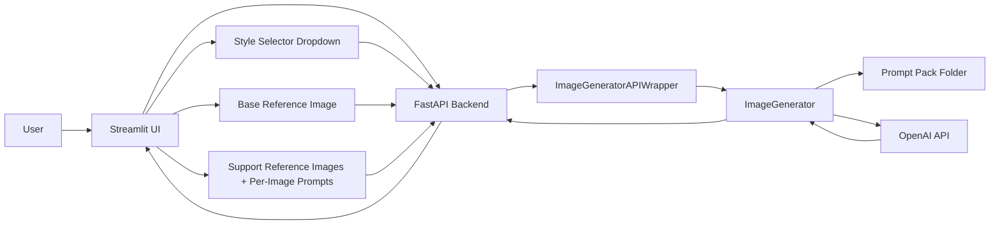

## AI Photo Studio - Product Needs (MVP)

## 1) Product Goal

Build a generic AI Photo Studio that supports multiple photography domains through interchangeable prompt packs (for example architectural, jwellery, food), while keeping the code path and UI flow the same.

Core idea:
- code stays stable
- prompt pack changes behavior
- one shared extraction and generation pipeline

## 2) Current Domain Packs

- architectural_photography
- jwellery_photography
- food_photography

Each prompt pack must contain:
- base_render_system_prompt.txt
- final_presentation_profile.txt
- generation_prompt_template.txt
- spec_extraction_prompt.txt

## 3) End-to-End User Flow

1. User selects photography style from dropdown (prompt pack).
2. User uploads one base reference image (main anchor image).
3. User uploads multiple support reference images.
4. User provides one support prompt per support image (what that image should influence).
5. User clicks spec extraction.
6. Backend extracts structured specifications using AI structured output.
7. UI displays editable key-value spec rows.
8. User edits specs and enters additional prompt.
9. User clicks generation.
10. Backend generates one final output image by combining all context: base anchor image, support references, per-support prompts, extracted/edited specs, and global user prompt.
11. UI shows final result and allows download/save-as-reference.

## 4) Functional Requirements

### 4.1 Style Management

- UI must load available prompt folders from backend.
- UI must set active prompt folder without backend restart.
- Backend validates selected prompt pack contains all required files.
- Active style is visibly shown in UI near generation controls.

### 4.2 Spec Extraction

- Extraction must return structured Specifications model internally.
- API response remains frontend-friendly (`spec` dict + `bullet_points`).
- Extraction should prioritize the base reference image for scene/product structure and use support references as optional detail/style hints.
- On style/config/runtime failure, return clear error message: `No image generation style loaded.`

### 4.3 Image Generation

- Output count is always 1.
- Base reference image is the primary composition/geometry anchor.
- Support references contribute targeted influence only (material, mood, lighting, styling, texture, color, etc.).
- Each support reference must have a per-image intent prompt.
- Final rendering must consider all inputs together in a single pass:
  - base anchor image
  - support reference images
  - support-reference prompts
  - structured extracted/edited specs
  - user global prompt
  - selected style pack prompt files
- On errors, return placeholder image with clear message.

## 5) Target API Surface (Next Iteration)

- `GET /health`
- `GET /prompt-packs`
  - returns active_prompt_pack and available_prompt_packs
- `POST /prompt-packs/select`
  - input: prompt_pack
  - switches active style at runtime
- `POST /spec/extract`
  - base reference (required) + support references (optional)
  - returns extracted spec + bullet points
- `POST /generate/references`
  - base reference + support references + support prompts + prompt + spec_json
  - returns one base64 generated image

## 6) High-Level Architecture

## 7) Architectural Photography - Complete Detail

This section defines how the architectural_photography style should behave.

### 7.1 Intent

- Transform rough architectural references into polished, photorealistic results.
- Preserve geometry/layout and camera framing from the base reference unless explicitly requested.
- Improve realism primarily via materials, lighting, reflections, and finish quality.

Support-reference behavior in architectural mode:
- Example support reference intents: material finish, lighting mood, color palette, decor style cues.
- Support references should not override base geometry/layout constraints.

### 7.2 Hard Constraints

- No camera/framing/perspective drift unless explicitly requested.
- No major architectural additions/removals.
- No arbitrary object movement, resizing, or orientation changes.
- No text, logos, labels, or watermarks.

### 7.3 Quality Profile

- Final-presentation visual quality.
- Realistic material roughness/reflections.
- Balanced architectural lighting and clean shadows.
- Client-ready finish.

### 7.4 Expected Spec Themes

Extraction may include keys such as:
- room_type
- style
- material themes
- wall/floor/ceiling notes
- lighting intent
- composition constraints

Spec keys are editable and not schema-locked in UI; users can add/remove fields.

### 7.5 Prompt Assembly Pattern

Generation prompt is built from:
1. base_render_system_prompt.txt
2. final_presentation_profile.txt
3. generation_prompt_template.txt
4. serialized extracted/edited spec JSON
5. base reference anchor instruction
6. support reference images + per-image intent prompts
7. additional user intent text

Final generation objective:
- Produce one image that preserves anchor composition while integrating the best relevant signals from support references and prompts.

### 7.6 Failure Mode

If style files are missing or invalid, the system surfaces:
- `No image generation style loaded.`

## 8) UI/UX Requirements (Current MVP)

- Single-page Streamlit flow.
- Dedicated base reference image picker (exactly one active base image).
- Support reference section with one prompt input per support image.
- Editable spec grid.
- Prompt text area.
- Style dropdown + apply + refresh controls.
- Active style badge visible before generation.
- Generated output section displays exactly one final image per run.

## 9) Scope Boundary (MVP)

- Single local workspace usage.
- No multi-tenant/auth workflow.
- No persistent backend project storage required for MVP.
- Focus on predictable generation behavior via style packs.

