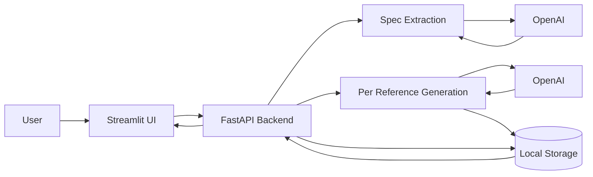

## Home Builder Renderer - Ultra Simple Architecture

## 1) Product Flow

1. User uploads reference images.
2. Core engine sends uploaded images to AI for feature extraction.
3. AI returns structured architectural spec text/JSON.
4. Number of views is automatically the same as number of uploaded reference images.
5. User edits only:
   - architectural spec fields
   - one additional user prompt
6. For each reference image, backend sends to AI:
   - that reference image
   - latest design spec
   - user prompt
   - recent generated images
   - recent messages
7. AI returns one final rendered image per reference image.
8. UI shows rendered results.

## 2) What AI Extracts

AI should return a structured spec with fields like:

- room_type
- dimensions
- floor material/color/pattern
- wall colors
- ceiling type/finish
- window style/frame color
- lighting temperature/intensity
- constraints (preserve layout, avoid issues)
- Any other details needed by AI to make it efficient

## 3) Ultra Simple Components

- UI (Streamlit): upload images, edit extracted spec, enter prompt, view outputs.
- Core Engine (Python services):
  - spec extraction from images
  - prompt/context assembly
  - per-reference image generation
- Backend API (FastAPI): receive requests and return results.
- Local Storage:
  - reference images
  - generated images
  - local metadata

## 4) Architecture Diagram

## 5) Per-Image Generation Logic

If user uploads `n` reference images:

- Output count = `n`
- For each `i` in `1..n`:
  - input reference image `i`
  - apply same latest design spec
  - apply same user prompt
  - include recent history context
  - generate final image `i`

This keeps output viewpoints aligned with uploaded references.

## 6) Simple API Shape

- `POST /projects/{id}/references` (upload reference images)
- `POST /projects/{id}/spec/extract` (extract spec from images + prompt)
- `PUT /projects/{id}/spec` (user edits spec)
- `POST /projects/{id}/generate` (generate one output per reference)
- `GET /runs/{id}` (status + outputs)
- `GET /projects/{id}/gallery` (final rendered images)

## 7) Scope Rules

- Keep one local workspace mode.
- No multi-project workflow complexity.
- Keep error handling simple and direct for MVP.

