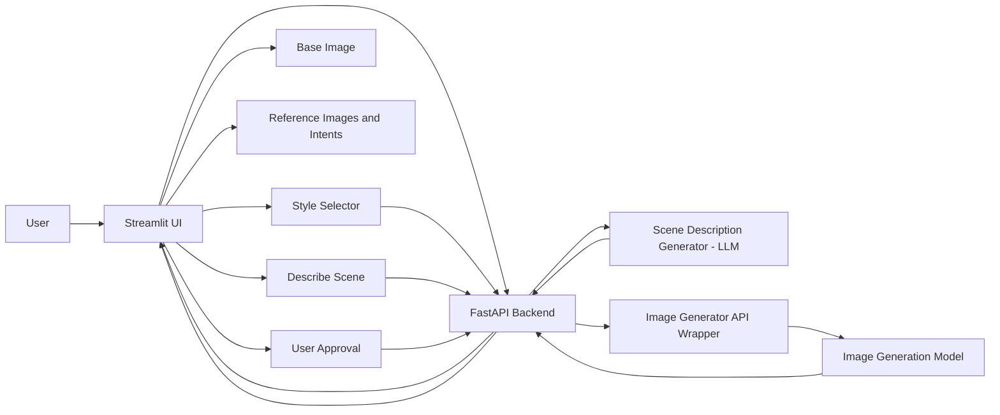

## AI Photo Studio — Product Needs (MVP)

Purpose
-------
Design an AI Photo Studio focused on a simple, reliable two-step workflow:

- Step A — Scene Description: user supplies one base image + zero-or-more reference images and short prompts; an LLM synthesizes a single, detailed scene description tailored to the selected photography style.
- Step B — Image Generation: after the user reviews/edits/approves the scene description, the backend generates exactly one final image using the approved description plus all image inputs and style prompts.

Principles
----------
- Single canonical flow for all styles (style packs change text prompts to the LLM and generation model, not code flow).
- The LLM's role is to create a human- and machine-readable scene description that the image generator consumes.
- The user always reviews and approves the scene description before generation.

Prompt Pack Requirements
-----------------------
Each style folder must include:

- `base_render_system_prompt.txt` — must be injected into the LLM call to enforce style constraints.
- `final_presentation_profile.txt` — post-processing quality / finishing guidance.
- `generation_prompt_template.txt` — template pieces used to build the final generation prompt for the image model.
- `spec_extraction_prompt.txt` — (optional) helper prompts or examples used during scene-description generation.

End-to-end User Flow (fresh)
----------------------------

1. User chooses a style pack from the dropdown.
2. User uploads exactly one base (anchor) image and zero-or-more reference images.
3. Optionally, the user enters a short per-reference intent for each support image and a short global user prompt.
4. User clicks `Describe Scene`.
   - Backend: collects images, per-image intents, global prompt and injects `base_render_system_prompt.txt` for the chosen style into an LLM call.
   - LLM: returns a structured `spec` (JSON-like key/value), a human-friendly `scene_description` string, and concise `bullet_points` explaining important decisions.
5. UI: displays editable `scene_description` and the structured `spec` for inline edits.
6. User edits and approves the scene description (final approval required to proceed).
7. User clicks `Generate`.
   - Backend assembles the final generation prompt using `generation_prompt_template.txt`, `final_presentation_profile.txt`, approved `scene_description`, `spec`, all images and per-image intents, then calls the image-generation model.
8. Backend returns a single base64 image plus optional `diagnostics` and `bullet_points` used for reproducibility.
9. UI displays the image and offers download/save-as-reference.

API Endpoints (recommended)
---------------------------

- `GET /health` — basic health check.
- `GET /prompt-packs` — returns `{ "active_prompt_pack": "...", "available_prompt_packs": [ ... ] }`.
- `POST /prompt-packs/select` — body `{ "prompt_pack": "architectural_photography" }` to change active style.
- `POST /scene/describe` — payload (multipart/form-data):
  - `base_image` (file, required)
  - `reference_images[]` (files, optional)
  - `reference_intents[]` (strings matching `reference_images[]` order, optional)
  - `global_prompt` (string, optional)
  - `style` (string, optional; server uses active style if not provided)

  Returns:

  {
    "scene_description": "...",
    "spec": { ... },
    "bullet_points": ["..."]
  }

- `POST /generate/references` — payload (multipart/json mix):
  - `base_image` (file)
  - `reference_images[]` (files)
  - `reference_intents[]` (strings)
  - `scene_description` (string) — required, must be user-approved
  - `spec` (JSON) — optional edited spec
  - `global_prompt` (string)
  - `style` (string)

  Returns:

  {
    "image_base64": "...",
    "diagnostics": { "model": "..., "prompt": "..." }
  }

Design & Data Models (concise)
------------------------------

- SceneDescriptionResponse:
  - `scene_description`: string
  - `spec`: dict (flexible key/value pairs)
  - `bullet_points`: list[str]

- GenerationRequest: includes final `scene_description`, `spec`, images, intents, style.

High-level Architecture
-----------------------

Style Pack Behavior
-------------------

- The style pack must be injected in two places:
  1. Scene-description LLM call (via `base_render_system_prompt.txt`) so the description obeys style constraints (tone, composition rules, preservation rules).
  2. Generation prompt assembly (`generation_prompt_template.txt` + `final_presentation_profile.txt`) to influence rendering quality and finishing.

UI/UX Guidelines (MVP)
----------------------

- Single-page flow.
- Style selector and visible active style badge.
- Base image uploader (single required slot).
- Reference image uploader with short per-image intent fields.
- `Describe Scene` button and editable `scene_description` + structured `spec` view.
- `Generate` button only enabled after user approval of the scene description.
- Result card with the generated image and download/save-as-reference actions.

Failure Modes & Diagnostics
--------------------------

- Missing/invalid style files → clear error: `No image generation style loaded.`
- LLM failure → return partial `scene_description` (if any) and `error` describing the failure.
- Generation failure → return placeholder image and a `diagnostics` object with model response and error hints.

Security & Privacy Notes
------------------------

- Images and prompts are treated as user data; keep them local for MVP unless user opts to persist or send to external services.
- If using third-party APIs, ensure users are informed that data (images/prompt text) will be transmitted.

Next Practical Steps
--------------------

1. Add API route stubs for `POST /scene/describe` and `POST /generate/references` in `backend_api/app/main.py` (or the existing router).
2. Implement `SceneDescriptionGenerator` wrapper that calls the LLM and returns the `SceneDescriptionResponse` model.
3. Implement `ImageGeneratorAPIWrapper` that assembles the final prompt and calls the image generation model.

If you want, I can scaffold the API endpoints and Pydantic models next (`SceneDescriptionResponse`, `GenerationRequest`) and add a minimal integration using the existing `image_generator.py` service as a starting point.

